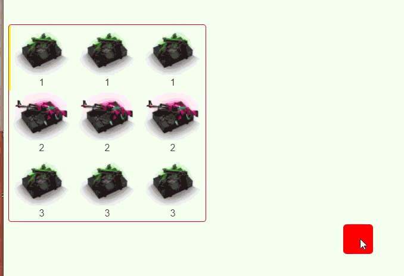

# draw lottery
一个横向竖向滚动抽奖，用到import TweenMax from 'gsap'，TweenMax的插件
let webUrl = 网址：https://www.tweenmax.com.cn/api/tweenmax/TweenMax()
```js
<draw-lottery/>
```
## props
| 描述 | 名称 | 类型 | 例子 | 解释 | 是否必传 |
| :----- | :-----:| :-----:  | :----- | :----- | :----- |
| 动画时间 | animationTime | Number:10 | 10 | 10秒 | no | 
| 列表数据  | multiDrawData | Array | {drawData:[{src:'',name:''},drawDataSuccess:{}],} | 包含全部数据以及中将数据 | yes |
| 中奖位置 | winPrizeIndex | String:-2000  | -2000 | 多少px，总长 | yes |
| 中奖前留几个 | winIndex | Number:0 | 1 | （是第1个） | yes |
| 滚动方式 | drawXY | Boolean:true  | Y:true X:false |  Y:true X:false | no |
| 模型数据 | resData | Object  | resData 定义样式 | 下方resData | yes |
| 动画初始化 | TweenMaxInit | Object | {ease:""} | webUrl上方地址 |  no |
| 开始动画 | getStart | Function | 收不到参数（bug） | webUrl上方地址 | no |
| 进行中 | getUpdate | Function | 收不到参数（bug） | webUrl上方地址 | no |
| 已结束 | getComplete | Function | 收不到参数（bug） |  webUrl上方地址 | no |
| Repeat | getRepeat | Function | 收不到参数（bug） | webUrl上方地址 | no |

### multiDrawData
```js
   multiDrawData: [
        {
            // 全部数据
          drawData: [
            {
              src: "https://asset.yskins.com/9frg4EpbifmM1FjkvQtu3hvSMoEF0h9JjjpzfeLv.png",
              name: "1",
            },
            {
              src: "https://asset.yskins.com/Ke4T4zu8wQTmHWdHGFuqwarAzIAe9wPlaMAasu76.png",
              name: "2",
            },
            {
              src: "https://asset.yskins.com/9frg4EpbifmM1FjkvQtu3hvSMoEF0h9JjjpzfeLv.png",
              name: "3",
            },
            {
              src: "https://asset.yskins.com/Ke4T4zu8wQTmHWdHGFuqwarAzIAe9wPlaMAasu76.png",
              name: "4",
            },
          ],
          // 中将
          drawDataSuccess: {
            src: "https://asset.yesskins.com/pvzZR7bOvTkf9jPYlDo1d6rnrA3x7u6RPbCv0Ljm.png",
            name: "中奖1",
          },
        },
       ],

```

### resData 定义样式
   - WH:定义宽高必填，其他样式随便，定义在style内的样式，(必传宽高)，要加入溢出隐藏属性
   - IdBox：最外层div添加类，可以添加背景，
   - Flex：套在滚动的外框添加类，这个控制横竖想滚动，
   - classBox:每一个滚动的小item添加类，
   - classImg：内部图片添加类，
   - 名称使用div包裹，可使用.XX div{}定义

```js
{
    WH:{
    width:'110',
    height:"110",
    overflow:"hidden",
    },
    IdBox:[''],
    classBox:['',''],
    classImg:[''],Flex:['']
}
```


    
